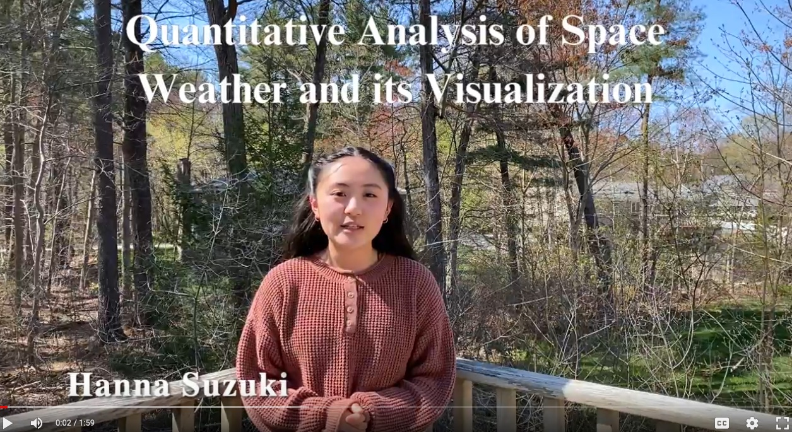

# Quantitative Analysis of Space Weather and its Visualization

  
  

  Click this image to view a demo video! 

Project Description:

Space weather refers to the environmental effects of the Sun in outer space. It causes geomagnetic storms on Earth, and those storms affect various infrastructures such as power grids, communications and transportation. Although this is a planetary risk that impacts human life, the public awareness and understanding of space weather are limited.

This project approaches this issue by analyzing geomagnetic storm data quantitatively and processing them with statistical and machine learning methods. Data analysis involves interpreting geomagnetic disturbance in linear and logarithmic scales. Data processing includes smoothing temporal data changes, reducing the impacts of outliers and obtaining a regression curve. The data analysis and processing work extracts essential quantitative measures from large-scale datasets; for example, the current conditions and forecast of geomagnetic storms. It also constructs easy-to-understand measures from complex data; for example, how much time the current solar cycle has progressed, how many more storms likely to happen in the the current cycle, and whether the current cycle is more or less severe than the past cycles.
 
The extracted/constructed data are visualized on a digital message board in a way that non-experts (even K-12 students) can understand. It can be placed at home; for example, on a refrigerator door or a kitchen counter. It can also be placed at public spaces such as school hallways, libraries and city halls. A half-reflective mirror can be integrated with this device to be a smart mirror, where people can learn about geomagnetic storms everyday while brushing their teeth or hair.

A goal of this project is to help people better understand geomagnetic storms quantitatively as they understand earth weather with quantitative measures such as precipitation percentage and hurricane categories. Ultimately, this project aims to help people be well informed and prepared for potential severe storms. 

